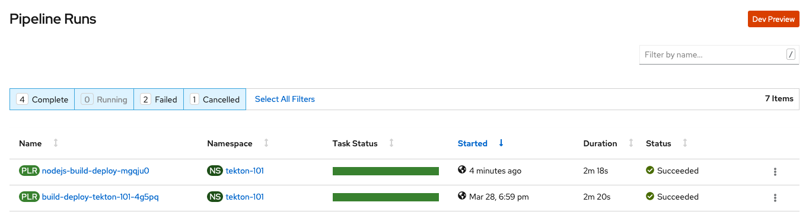

= Tekton 101
:toc: macro
:toclevels: 4

toc::[]

== Overview

OpenShift Pipelines Operator version 0.10.7

=== Intro

* Tekton

* Tekton Trigger

* Workspace
** used for internal storage of files during step executions
** a convention exists, that PipelineResources will be placed in sub directories with the name of the parameter name. E.g. the git repository will be cloned into `/workspace/git-src` if the git parameter is `git-src`.

=== Preparations

* OpenShift 4 Cluster
** link:https://www.ibm.com/uk-en/cloud/openshift[Red Hat OpenShift on IBM Cloud]

* Install OpenShift Pipeline
** Open OpenShift WebConsole
** Select `Operators` > `OperatorHub`
** Search for `OpenShift Pipelines Operator`
** Select Operator and install, with default settings and `subscribe`
** Verify the state `Running` pods in `openshift-pipelines` namespace
** Reload the OpenShift WebConsole and verify if the menu item `Pipelines` exists

* Permissions
** `oc get serviceaccount pipeline`
** OpenShift Pipeline has this serviceaccount `pipeline` by default.
** All our `EventListener` will use this serviceaccount

* GitHub Secret
** Not relevant cause the GitHub repository is public and not token is needed to pull the code

* Tekton Pipeline and Task definitions

.Create project, pipeline and trigger resources
----
$ oc new-project tekton-101

$ oc apply -f pipelines/01_create_pipeline.yaml
pipeline.tekton.dev/nodejs-build-deploy created

$ oc get pipeline
NAME                  AGE
nodejs-build-deploy   5s

$ oc apply -f pipelines/02_create_template.yaml
triggertemplate.tekton.dev/nodejs-build-deploy-trigger-template created
triggerbinding.tekton.dev/nodejs-build-deploy-trigger-binding created
eventlistener.tekton.dev/nodejs-build-deploy-trigger-listener created

$ oc get triggertemplate
NAME                                   AGE
nodejs-build-deploy-trigger-template   54s
----

To register the GitHub Webhook is an external reachable URL from the service endpoint of the `EventListener` needed.

.Expose route for GitHub Webhook registration
----
$ oc get svc
NAME                                      TYPE        CLUSTER-IP      EXTERNAL-IP   PORT(S)    AGE
el-nodejs-build-deploy-trigger-listener   ClusterIP   172.30.61.224   <none>        8080/TCP   4m57s

$ oc expose svc el-nodejs-build-deploy-trigger-listener
route.route.openshift.io/el-nodejs-build-deploy-trigger-listener exposed

$ echo "$(oc  get route el-nodejs-build-deploy-trigger-listener --template='http://{{.spec.host}}')"
http://el-nodejs-build-deploy-trigger-listener-tekton-101.apps.cluster-56ea.sandbox779.opentlc.com
----

* Volume, PVC
** na

* Register in GitHub the Webhook
** Select the repository in GitHub
** Select `Settings` > `Webhooks`
** Press `Add Webhook`
** Enter the URL of the `EventListener`
** Set Content-Type to `application/json`
** Let the default configuration, like only `push` events
** Pres `Add Webhook`
* Verify the GitHub Webhook
** Select `Settings` > `Webhooks`
** Select the listed Webhook URL
** Check the output in `Recent Deliveries`, the last push should be positive like `202`

=== Testing

* GitHub Commit
** Push a new commit to the repository
** Verify the log of the `EventListener` pod

.Verify the logs of the EventListener
----
$ oc logs -f el-nodejs-build-deploy-trigger-listener-57d5686ccd-7s6h6

{"level":"info","logger":"eventlistener","caller":"sink/sink.go:147","msg":"params: %+v[{git-revision {string 8c784a4b9fc9538de3218a55b0a4b1623cd18ba7 []}} {git-repo-url {string https://github.com/haf-tech/tekton-101 []}} {git-repo-name {string tekton-101 []}} {project-name {string tekton-101 []}}]","knative.dev/controller":"eventlistener","/triggers-eventid":"fbgjt","/trigger":"nodejs-build-deploy-trigger-listener-t1"}
{"level":"info","logger":"eventlistener","caller":"resources/create.go:91","msg":"Generating resource: kind: &APIResource{Name:pipelineresources,Namespaced:true,Kind:PipelineResource,Verbs:[delete deletecollection get list patch create update watch],ShortNames:[],SingularName:pipelineresource,Categories:[tekton tekton-pipelines],Group:tekton.dev,Version:v1alpha1,}, name: git-repo-tekton-101-wwsh7","knative.dev/controller":"eventlistener"}
{"level":"info","logger":"eventlistener","caller":"resources/create.go:99","msg":"For event ID \"fbgjt\" creating resource tekton.dev/v1alpha1, Resource=pipelineresources","knative.dev/controller":"eventlistener"}
{"level":"info","logger":"eventlistener","caller":"resources/create.go:91","msg":"Generating resource: kind: &APIResource{Name:pipelineresources,Namespaced:true,Kind:PipelineResource,Verbs:[delete deletecollection get list patch create update watch],ShortNames:[],SingularName:pipelineresource,Categories:[tekton tekton-pipelines],Group:tekton.dev,Version:v1alpha1,}, name: image-tekton-101-wwsh7","knative.dev/controller":"eventlistener"}
{"level":"info","logger":"eventlistener","caller":"resources/create.go:99","msg":"For event ID \"fbgjt\" creating resource tekton.dev/v1alpha1, Resource=pipelineresources","knative.dev/controller":"eventlistener"}
{"level":"info","logger":"eventlistener","caller":"resources/create.go:91","msg":"Generating resource: kind: &APIResource{Name:pipelineruns,Namespaced:true,Kind:PipelineRun,Verbs:[delete deletecollection get list patch create update watch],ShortNames:[pr prs],SingularName:pipelinerun,Categories:[tekton tekton-pipelines],Group:tekton.dev,Version:v1alpha1,}, name: build-deploy-tekton-101-wwsh7","knative.dev/controller":"eventlistener"}
{"level":"info","logger":"eventlistener","caller":"resources/create.go:99","msg":"For event ID \"fbgjt\" creating resource tekton.dev/v1alpha1, Resource=pipelineruns","knative.dev/controller":"eventlistener"}
----

A new PipelineRun will be triggered and new pod created to execute all tasks

----
$ oc get pipelinerun
NAME                            SUCCEEDED   REASON    STARTTIME   COMPLETIONTIME
build-deploy-tekton-101-wwsh7   Unknown     Running   2m48s

$ oc get pods
NAME                                                              READY   STATUS    RESTARTS   AGE
build-deploy-tekton-101-wwsh7-nodejs-build-image-24g9b-po-fgltb   3/6     Running   0          3m40s
el-nodejs-build-deploy-trigger-listener-57d5686ccd-7s6h6          1/1     Running   0          22m

$ oc logs -f build-deploy-tekton-101-wwsh7-nodejs-build-image-24g9b-po-fgltb
Error from server (BadRequest): a container name must be specified for pod build-deploy-tekton-101-wwsh7-nodejs-build-image-24g9b-po-fgltb, choose one of: [step-create-dir-image-gl7vp step-git-source-git-repo-tekton-101-wwsh7-wz8pc step-generate step-build step-push step-image-digest-exporter-lv5jh] or one of the init containers: [credential-initializer working-dir-initializer place-tools]

# Display the logs for the Docker Build step
$ oc logs -f build-deploy-tekton-101-wwsh7-nodejs-build-image-24g9b-po-fgltb -c step-build
{"level":"info","ts":1585410738.4441009,"logger":"fallback-logger","caller":"logging/config.go:69","msg":"Fetch GitHub commit ID from kodata failed: \"KO_DATA_PATH\" does not exist or is empty"}
STEP 1: FROM registry.access.redhat.com/rhscl/nodejs-10-rhel7
Getting image source signatures
Copying blob sha256:81aa2695e9554e4aa95038da2bfa0ed5c5c5bc89894b4b6b4835494ebfbad26a
Copying blob sha256:455ea8ab06218495bbbcb14b750a0d644897b24f8c5dcf9e8698e27882583412
Copying blob sha256:bb13d92caffa705f32b8a7f9f661e07ddede310c6ccfa78fb53a49539740e29b
Copying blob sha256:46fc24a071a44b29a3ba49c94f75a47514a56470d539c9204f3e7688973fc93a
Copying blob sha256:84e620d0abe585d05a7bed55144af0bc5efe083aed05eac1e88922034ddf1ed2
Copying config sha256:3e32112e4287d3f7253b2c1c177de3270e5aed79704a1c6dd0106a7ef35bf5f0
Writing manifest to image destination
Storing signatures
STEP 2: LABEL "io.openshift.s2i.build.source-location"="."       "io.openshift.s2i.build.image"="registry.access.redhat.com/rhscl/nodejs-10-rhel7"
acdd91811a17bcd587f1c95c41a272080f7c87d1e2682bd40b7a15a906bc2c30
STEP 3: USER root
b9c195b2cfa39504f02ceefc4c5a6c50b7c755d01d80918c6c5bac03371a421a
STEP 4: COPY upload/src /tmp/src
38e0e1f63d6d120b4dfa04ac2faed15e7f149bb221254b634e838a17b1640480
STEP 5: RUN chown -R 1001:0 /tmp/src
e1eeb23c5a2b6db1e9136094e07d96ad4ba61db6b8851dc2584c75fe6aa343f2
STEP 6: USER 1001
9b926ec03a7bb44a46dd761da2b4318d6809098289e869447d66191f2bddacc5
STEP 7: RUN /usr/libexec/s2i/assemble
---> Installing application source ...
---> Installing all dependencies
added 97 packages from 85 contributors and audited 184 packages in 4.007s
found 0 vulnerabilities

---> Building in production mode
---> Pruning the development dependencies
audited 184 packages in 1.105s
found 0 vulnerabilities

/opt/app-root/src/.npm is not a mountpoint
---> Cleaning the npm cache /opt/app-root/src/.npm
/tmp is not a mountpoint
---> Cleaning the /tmp/npm-*
022f94d2c89f5f9ff2def67acd95f8ca53b3f7d62f4f0d9759d437e732ad1463
STEP 8: CMD /usr/libexec/s2i/run
STEP 9: COMMIT image-registry.openshift-image-registry.svc:5000/tekton-101/tekton-101:latest
b9e432bdb97b2fc3f76c77405d0b518162096e9aaecd3ed33fb56326ba6eb945
b9e432bdb97b2fc3f76c77405d0b518162096e9aaecd3ed33fb56326ba6eb945
----

After the pipeline run a new image is pushed and an ImageStream is also created

----
$ oc get is
NAME         IMAGE REPOSITORY                                                         TAGS     UPDATED
tekton-101   image-registry.openshift-image-registry.svc:5000/tekton-101/tekton-101   latest   2 minutes ago
----

* Direct Webhook Call

=== Workarounds

The OpenShift CLI does not recognize well all arguments and parameters

[source,yaml]
----
params:       
    - name: ARGS
      value: 
      - "apply -f $(params.k8s_manifests)"
----
Results in `Error: unknown command "apply -f k8s" for "oc"`
Also
----
params:       
    - name: ARGS
      value: 
      - "apply"
      - "-f"
      - $(params.k8s_manifests)"
----

=== Clean up

Currently the OpenShift Pipeline does not clean up old pipeline runs.

== References

* Tekton TriggerTemplate: link:https://github.com/tektoncd/triggers/blob/master/docs/triggertemplates.md[]

== License

This article and project are licensed under the Apache License, Version 2.
Separate third-party code objects invoked within this code pattern are licensed by their respective providers pursuant
to their own separate licenses. Contributions are subject to the
link:https://developercertificate.org/[Developer Certificate of Origin, Version 1.1] and the
link:https://www.apache.org/licenses/LICENSE-2.0.txt[Apache License, Version 2].

See also link:https://www.apache.org/foundation/license-faq.html#WhatDoesItMEAN[Apache License FAQ]
.