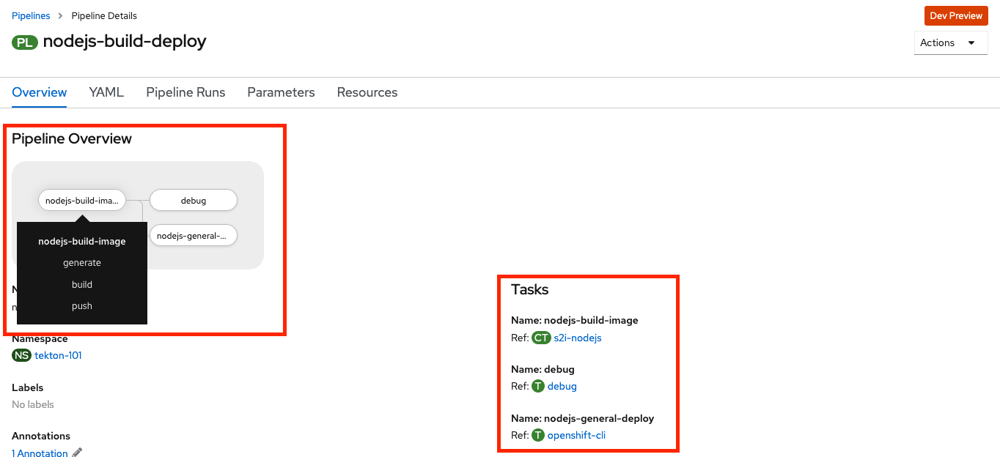
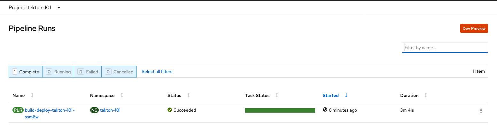

= Tekton 101
:author: Hafid Haddouti
:toc: macro
:toclevels: 4
:sectlinks:
:sectanchors:

toc::[]

== Overview

Tekton ...
[quote, Tekton, 'https://github.com/tektoncd/pipeline/tree/master/docs[Tekton Docu]']
----
 [...] defines a set of Kubernetes Custom Resources that act as building blocks from which you can assemble CI/CD pipelines.
----

It provides the capabilities to automate the most needed activities to build, package, push and deploy a cloud-native application with the help project specific CI/CD pipelines.
link:https://github.com/tektoncd/pipeline[Tekton] is primarily a framework and only with the re-usable tasks and pipelines the power becomes visible. There are currently the following catalogs holding different re-usable fragments

* link:https://github.com/tektoncd/catalog[Tekton catalog]
* link:https://github.com/openshift/pipelines-catalog[OpenShift Pipeline Catalog]
* link:https://github.com/kabanero-io/kabanero-pipelines[Kabanero Pipelines]

This article considers the Tekton integration in OpenShift 4 named link:https://www.openshift.com/learn/topics/pipelines[OpenShift Pipelines], tested with

* version 0.10.7, March 2020: use the `pipelines/base/v0.10` yaml files
* version 1.0.1, May 2020: use the `pipelines/base/v1.0` yaml files. 

The article is divided in the following sections

* <<base_pipeline,Base pipeline usage>>: handles the complete pipeline to build, package, push and deploy an application from a GitHub repository
* <<advanced_pipeline,Advanced pipeline usage>>: extends the base pipeline with additional topics like resource sharing, private registry etc.
* <<additional_topics,Additional topics>>: Further remaining topics like housekeeping will be handled in the last chapter.

and will handle the latest OpenShift Pipeline version.

=== Intro

* Tekton
** `Tekton` is a cloud-native framework to support generally the creation of CI/CD pipelines. For a detailed explanation of Tekton with all available Tekton entities see the link:https://github.com/tektoncd/pipeline/tree/master/docs#understanding-tekton-pipelines[Tekton GitHub docu].
*** link:https://github.com/tektoncd/pipeline/blob/master/docs/pipelines.md[`Pipeline`] is the definition of the continuous integration flow, representing various ``Task``s. An instance of a `Pipeline` is a `PipelineRun`.
*** link:https://github.com/tektoncd/pipeline/blob/master/docs/tasks.md[`Task`] is a collection of ``Step``s to achieve a certain state. An instance of a `Task` is a `TaskRun`.
*** A `Pipeline` could contain and reference general ``Task``s and project specific definitions. One of key concepts of Tekton is the re-usability and this is reflected in the `ClusterTask` resource type and the possibility to reference a task definition.

* Tekton Trigger
** `Trigger` enhance the Tekton architecture with the capability to react on (external) events and start a predefined `Pipeline`
** Trigger introduced the following new CRDs
*** link:https://github.com/tektoncd/triggers/blob/master/docs/triggertemplates.md[`TriggerTemplate`]: a template which will be used if a new event occurred. This template creates the relevant resources and trigger the pipeline
*** link:https://github.com/tektoncd/triggers/blob/master/docs/triggerbindings.md[`TriggerBinding`]: a binding definition which extract from the event payload the relevant information/parameters which will be used in the TriggerTemplate
*** link:https://github.com/tektoncd/triggers/blob/master/docs/eventlisteners.md[`EventListener`]: the entry point which retrieves the Event and uses the `TriggerBinding` to extract the parameters and delegate this to the `TriggerTemplate`.

* link:https://github.com/tektoncd/pipeline/blob/master/docs/workspaces.md[`Workspace`]
** used for internal storage of files during step executions
** a convention exists, that PipelineResources will be placed in sub directories with the name of the parameter name. E.g. the git repository will be cloned into `/workspace/git-src` if the git parameter is `git-src`.

[#base_pipeline]
== Base Pipeline

The base pipeline consists of 3 tasks

* `nodejs-build-image`: a re-use of the existing `ClusterTask` `s2i-nodejs` to build, package and push nodejs applications
* `debug`: a common task to list all files in the workspace (which contains the Git repository)
* `custom-general-deploy`: uses the enhanced `openshift-cli` task to deploy the application

All definitions are in the directory link:pipelines/base[]. Consider to use the right sub-dir dependent from the OpenShift Pipeline Operator version.
The idea of the pipeline is, that a new event (like a Git Push commit) will trigger the pipeline. The first task is the execution of the existing `s2i-nodejs` task which will receive the Git repository and the expected image stream name/value. The resulting docker image will be pushed to the internal registry in the current namespace.
The `custom-general-deploy` runs after the `s2i-nodejs` task and (re-)applies the kubernetes manifest files in link:k8s[] or link:openshift[]  directory. This results in a new or updated `Deployment`, `Route` and `Service` objects.
After a successful pipeline run the application is updated and up and running.

The presented pipeline here is a simplified but common definition. Only the first task is solution/application specific one - as there is a technology stack dependency (here: nodejs).

=== Preparations

* OpenShift 4 Cluster
** link:https://www.ibm.com/uk-en/cloud/openshift[Red Hat OpenShift on IBM Cloud]

* Install OpenShift Pipeline
** Open OpenShift WebConsole
** Select `Operators` > `OperatorHub`
** Search for `OpenShift Pipelines Operator`
** Select Operator and install, with default settings and `subscribe`
** Verify the state `Running` pods in `openshift-pipelines` namespace
** Reload the OpenShift WebConsole and verify if the menu item `Pipelines` exists

NOTE: Consider to install the Red Hat provided version, but consider that here some differences exists (e.g. supported API version for Tekton/Trigger)

* Permissions
** `oc get serviceaccount pipeline`
** OpenShift Pipeline has this serviceaccount `pipeline` by default.
** All our `EventListener` will use this serviceaccount

* GitHub Secret
** Not relevant cause the GitHub repository is public and not token is needed to pull the code

=== Create and Configure Pipeline

This chapter handles the pipeline creation and some configuration, like the GitHub Webhook, so that any new push commit will trigger a new deployment.

* Tekton Pipeline and Task definitions

.Create project, pipeline and trigger resources
----
$ oc new-project tekton-101

$ oc apply -f pipelines/base/v1.0
task.tekton.dev/debug created
task.tekton.dev/openshift-cli created
pipeline.tekton.dev/nodejs-build-deploy created
triggertemplate.triggers.tekton.dev/nodejs-build-deploy-trigger-template created
triggerbinding.triggers.tekton.dev/nodejs-build-deploy-trigger-binding created
eventlistener.triggers.tekton.dev/nodejs-build-deploy-trigger-listener created

$ oc get pipeline
NAME                  AGE
nodejs-build-deploy   5s

$ oc get task
NAME            AGE
debug           20s
openshift-cli   20s

$ oc get triggertemplate
NAME                                   AGE
nodejs-build-deploy-trigger-template   54s

$ oc get eventlistener.triggers.tekton.dev
NAME                                   AGE
nodejs-build-deploy-trigger-listener   20s
----

To register the GitHub Webhook is an external reachable URL from the service endpoint of the `EventListener` needed.

.Expose route for GitHub Webhook registration
----
$ oc get svc
NAME                                      TYPE        CLUSTER-IP      EXTERNAL-IP   PORT(S)    AGE
el-nodejs-build-deploy-trigger-listener   ClusterIP   172.30.61.224   <none>        8080/TCP   4m57s

$ oc expose svc el-nodejs-build-deploy-trigger-listener
route.route.openshift.io/el-nodejs-build-deploy-trigger-listener exposed

$ echo "$(oc  get route el-nodejs-build-deploy-trigger-listener --template='http://{{.spec.host}}')"
http://el-nodejs-build-deploy-trigger-listener-tekton-101.apps.cluster-56ea.sandbox779.opentlc.com
----

* Register in GitHub the Webhook
** Select the repository in GitHub
** Select `Settings` > `Webhooks`
** Press `Add Webhook`
** Enter the URL of the `EventListener` from above
** Set Content-Type to `application/json`
** Let the default configuration, and add e.g. only `push` events
** Pres `Add Webhook`
* Verify the GitHub Webhook
** Select `Settings` > `Webhooks`
** Select the listed Webhook URL
** Check the output in `Recent Deliveries`, the last push should be positive like `202` or `201`

=== Testing 

==== Push and Deployment via GitHub Webhook

The test includes the push of a Git change which will trigger immediately a new pipeline run in OpenShift, because of the Webhook which send the event to the EventListener.

* GitHub Commit
** Push a new commit to the repository
** Verify the log of the `EventListener` pod

.Verify the logs of the EventListener
----
$ oc logs -f el-nodejs-build-deploy-trigger-listener-57d5686ccd-7s6h6

{"level":"info","logger":"eventlistener","caller":"sink/sink.go:147","msg":"params: %+v[{git-revision {string 8c784a4b9fc9538de3218a55b0a4b1623cd18ba7 []}} {git-repo-url {string https://github.com/haf-tech/tekton-101 []}} {git-repo-name {string tekton-101 []}} {project-name {string tekton-101 []}}]","knative.dev/controller":"eventlistener","/triggers-eventid":"fbgjt","/trigger":"nodejs-build-deploy-trigger-listener-t1"}
{"level":"info","logger":"eventlistener","caller":"resources/create.go:91","msg":"Generating resource: kind: &APIResource{Name:pipelineresources,Namespaced:true,Kind:PipelineResource,Verbs:[delete deletecollection get list patch create update watch],ShortNames:[],SingularName:pipelineresource,Categories:[tekton tekton-pipelines],Group:tekton.dev,Version:v1alpha1,}, name: git-repo-tekton-101-wwsh7","knative.dev/controller":"eventlistener"}
{"level":"info","logger":"eventlistener","caller":"resources/create.go:99","msg":"For event ID \"fbgjt\" creating resource tekton.dev/v1alpha1, Resource=pipelineresources","knative.dev/controller":"eventlistener"}
{"level":"info","logger":"eventlistener","caller":"resources/create.go:91","msg":"Generating resource: kind: &APIResource{Name:pipelineresources,Namespaced:true,Kind:PipelineResource,Verbs:[delete deletecollection get list patch create update watch],ShortNames:[],SingularName:pipelineresource,Categories:[tekton tekton-pipelines],Group:tekton.dev,Version:v1alpha1,}, name: image-tekton-101-wwsh7","knative.dev/controller":"eventlistener"}
{"level":"info","logger":"eventlistener","caller":"resources/create.go:99","msg":"For event ID \"fbgjt\" creating resource tekton.dev/v1alpha1, Resource=pipelineresources","knative.dev/controller":"eventlistener"}
{"level":"info","logger":"eventlistener","caller":"resources/create.go:91","msg":"Generating resource: kind: &APIResource{Name:pipelineruns,Namespaced:true,Kind:PipelineRun,Verbs:[delete deletecollection get list patch create update watch],ShortNames:[pr prs],SingularName:pipelinerun,Categories:[tekton tekton-pipelines],Group:tekton.dev,Version:v1alpha1,}, name: build-deploy-tekton-101-wwsh7","knative.dev/controller":"eventlistener"}
{"level":"info","logger":"eventlistener","caller":"resources/create.go:99","msg":"For event ID \"fbgjt\" creating resource tekton.dev/v1alpha1, Resource=pipelineruns","knative.dev/controller":"eventlistener"}
----

A new PipelineRun will be triggered and new pod created to execute all tasks

----
$ oc get pipelinerun
NAME                            SUCCEEDED   REASON    STARTTIME   COMPLETIONTIME
build-deploy-tekton-101-wwsh7   Unknown     Running   2m48s

$ oc get pods
NAME                                                              READY   STATUS      RESTARTS   AGE
build-deploy-tekton-101-4g5pq-debug-b9d5p-pod-vb8w7               0/1     Completed   0          15h
build-deploy-tekton-101-4g5pq-nodejs-build-image-tt5xr-po-v96g7   0/6     Completed   0          15h
build-deploy-tekton-101-4g5pq-custom-general-deploy-mln6r-lbhcw   0/2     Completed   0          15h
...
el-nodejs-build-deploy-trigger-listener-57d5686ccd-7s6h6          1/1     Running     0          18h
...
tekton-101-59cf598599-v27xr                                       1/1     Running     0          15h

$ oc logs -f build-deploy-tekton-101-4g5pq-nodejs-build-image-tt5xr-po-v96g7
Error from server (BadRequest): a container name must be specified for pod build-deploy-tekton-101-wwsh7-nodejs-build-image-24g9b-po-fgltb, choose one of: [step-create-dir-image-gl7vp step-git-source-git-repo-tekton-101-wwsh7-wz8pc step-generate step-build step-push step-image-digest-exporter-lv5jh] or one of the init containers: [credential-initializer working-dir-initializer place-tools]

# Display the logs for the Docker Build step
$ oc logs -f build-deploy-tekton-101-4g5pq-nodejs-build-image-tt5xr-po-v96g7 -c step-build
{"level":"info","ts":1585410738.4441009,"logger":"fallback-logger","caller":"logging/config.go:69","msg":"Fetch GitHub commit ID from kodata failed: \"KO_DATA_PATH\" does not exist or is empty"}
STEP 1: FROM registry.access.redhat.com/rhscl/nodejs-10-rhel7
Getting image source signatures
Copying blob sha256:81aa2695e9554e4aa95038da2bfa0ed5c5c5bc89894b4b6b4835494ebfbad26a
Copying blob sha256:455ea8ab06218495bbbcb14b750a0d644897b24f8c5dcf9e8698e27882583412
Copying blob sha256:bb13d92caffa705f32b8a7f9f661e07ddede310c6ccfa78fb53a49539740e29b
Copying blob sha256:46fc24a071a44b29a3ba49c94f75a47514a56470d539c9204f3e7688973fc93a
Copying blob sha256:84e620d0abe585d05a7bed55144af0bc5efe083aed05eac1e88922034ddf1ed2
Copying config sha256:3e32112e4287d3f7253b2c1c177de3270e5aed79704a1c6dd0106a7ef35bf5f0
Writing manifest to image destination
Storing signatures
STEP 2: LABEL "io.openshift.s2i.build.source-location"="."       "io.openshift.s2i.build.image"="registry.access.redhat.com/rhscl/nodejs-10-rhel7"
acdd91811a17bcd587f1c95c41a272080f7c87d1e2682bd40b7a15a906bc2c30
STEP 3: USER root
b9c195b2cfa39504f02ceefc4c5a6c50b7c755d01d80918c6c5bac03371a421a
STEP 4: COPY upload/src /tmp/src
38e0e1f63d6d120b4dfa04ac2faed15e7f149bb221254b634e838a17b1640480
STEP 5: RUN chown -R 1001:0 /tmp/src
e1eeb23c5a2b6db1e9136094e07d96ad4ba61db6b8851dc2584c75fe6aa343f2
STEP 6: USER 1001
9b926ec03a7bb44a46dd761da2b4318d6809098289e869447d66191f2bddacc5
STEP 7: RUN /usr/libexec/s2i/assemble
---> Installing application source ...
---> Installing all dependencies
added 97 packages from 85 contributors and audited 184 packages in 4.007s
found 0 vulnerabilities

---> Building in production mode
---> Pruning the development dependencies
audited 184 packages in 1.105s
found 0 vulnerabilities

/opt/app-root/src/.npm is not a mountpoint
---> Cleaning the npm cache /opt/app-root/src/.npm
/tmp is not a mountpoint
---> Cleaning the /tmp/npm-*
022f94d2c89f5f9ff2def67acd95f8ca53b3f7d62f4f0d9759d437e732ad1463
STEP 8: CMD /usr/libexec/s2i/run
STEP 9: COMMIT image-registry.openshift-image-registry.svc:5000/tekton-101/tekton-101:latest
b9e432bdb97b2fc3f76c77405d0b518162096e9aaecd3ed33fb56326ba6eb945
b9e432bdb97b2fc3f76c77405d0b518162096e9aaecd3ed33fb56326ba6eb945
----

After the pipeline run a new image is pushed and an ImageStream is also created

----
$ oc get is
NAME         IMAGE REPOSITORY                                                         TAGS     UPDATED
tekton-101   image-registry.openshift-image-registry.svc:5000/tekton-101/tekton-101   latest   2 minutes ago
----

The deployment task triggers a deployment using the manifest files in the `k8s` directory. Afterwards the pod is up and the route is also exposed.

----
$ oc get pods
NAME                                                              READY   STATUS      RESTARTS   AGE
build-deploy-tekton-101-4g5pq-debug-b9d5p-pod-vb8w7               0/1     Completed   0          50s
build-deploy-tekton-101-4g5pq-nodejs-build-image-tt5xr-po-v96g7   0/6     Completed   0          2m57s
build-deploy-tekton-101-4g5pq-custom-general-deploy-mln6r-lbhcw   0/2     Completed   0          50s
...
el-nodejs-build-deploy-trigger-listener-57d5686ccd-7s6h6          1/1     Running     0          150m
tekton-101-59cf598599-v27xr                                       1/1     Running     0          37s

$ oc get svc
NAME                                      TYPE        CLUSTER-IP       EXTERNAL-IP   PORT(S)          AGE
el-nodejs-build-deploy-trigger-listener   ClusterIP   172.30.61.224    <none>        8080/TCP         152m
tekton-101                                NodePort    172.30.201.115   <none>        5000:30815/TCP   7m1s

$ oc get routes
NAME                                      HOST/PORT                                                                                     PATH   SERVICES                                  PORT            TERMINATION   WILDCARD
el-nodejs-build-deploy-trigger-listener   el-nodejs-build-deploy-trigger-listener-tekton-101.apps.cluster-56ea.sandbox779.opentlc.com          el-nodejs-build-deploy-trigger-listener   http-listener                 None
tekton-101                                tekton-101-tekton-101.apps.cluster-56ea.sandbox779.opentlc.com                                       tekton-101                                5000-tcp                      None

$ curl -s "$(oc get route tekton-101 --template='http://{{.spec.host}}')"
[TEKTON_101]: Hello from NodeJS Playground! TEKTON_101_ENV_EXAMPLE=env value.
----

image:static/PipelineRun_Progress.png[One PipelineRun in OpenShift WebConsole, Running]

image:static/PipelineRun_Done.png[One PipelineRun in OpenShift WebConsole, Done successfully]

The GitHub Webhook triggers the Pipeline in OpenShift after the push commit. The result is new build and deployed application in OpenShift Cluster, with a registered route.

==== Deployment via direct EventListener call

The GitHub Webhook calls the `EventListener` entry point with a json payload. To simulate the GitHub Webhook call the defined `EventListerner` route with the following information

* as POST
* with content type `application/json`
* with a GitHub Event header contains the expected event defined in the `EventListener`.`triggers.interceptors.github.eventTypes` (here: `push`)
* the json payload with a minimum of the fields which are expected in `TriggerBinding`

----
$ curl -XPOST -H "Content-Type: application/json" -H "X-GitHub-Event: push" -d @pipelines/test/dummy_payload.json "$(oc  get route el-nodejs-build-deploy-trigger-listener --template='http://{{.spec.host}}')"
{"eventListener":"nodejs-build-deploy-trigger-listener","namespace":"tekton-101","eventID":"zxhxc"}

$ oc logs -f el-nodejs-build-deploy-trigger-listener-57d5686ccd-tlnlj
...
{"level":"info","logger":"eventlistener","caller":"sink/sink.go:147","msg":"params: %+v[{git-revision {string a5516c481f5b944b9be2872b37bfd23e8ed0acd6 []}} {git-repo-url {string https://github.com/haf-tech/tekton-101 []}} {git-repo-name {string tekton-101 []}} {project-name {string tekton-101 []}} {project-manifests {string openshift []}}]","knative.dev/controller":"eventlistener","/triggers-eventid":"zxhxc","/trigger":"nodejs-build-deploy-trigger-listener-t1"}
{"level":"info","logger":"eventlistener","caller":"resources/create.go:91","msg":"Generating resource: kind: &APIResource{Name:pipelineresources,Namespaced:true,Kind:PipelineResource,Verbs:[delete deletecollection get list patch create update watch],ShortNames:[],SingularName:pipelineresource,Categories:[tekton tekton-pipelines],Group:tekton.dev,Version:v1alpha1,}, name: git-repo-tekton-101-6vz4l","knative.dev/controller":"eventlistener"}
{"level":"info","logger":"eventlistener","caller":"resources/create.go:99","msg":"For event ID \"zxhxc\" creating resource tekton.dev/v1alpha1, Resource=pipelineresources","knative.dev/controller":"eventlistener"}
....

$ oc get pipelinerun
NAME                            SUCCEEDED   REASON      STARTTIME   COMPLETIONTIME
build-deploy-tekton-101-6vz4l   Unknown     Running     13s
build-deploy-tekton-101-ssm6w   True        Succeeded   23m         20m
----

The call triggers a new `PipelineRun` which redeploys the application.
This way allows to test and execute the pipeline without create a Git commit. 

[#advanced_pipeline]
== Advanced Pipeline

This chapter handles advanced topics. For verifying and testing the functionality use the pipeline definitions in the `pipelines/advanced` directory.

Apply the pipeline definitions and register the Webhook before go on with the next topics.

----
$ oc apply -f pipelines/advanced/v1.0/01
task.tekton.dev/debug created
task.tekton.dev/openshift-cli created
task.tekton.dev/debug2 created
task.tekton.dev/canary-deployment created
condition.tekton.dev/is-equal created
pipeline.tekton.dev/nodejs-build-deploy created
triggertemplate.triggers.tekton.dev/nodejs-build-deploy-trigger-template created
triggerbinding.triggers.tekton.dev/nodejs-build-deploy-trigger-binding created
eventlistener.triggers.tekton.dev/nodejs-build-deploy-trigger-listener created

$ oc expose svc el-t1-nodejs-build-deploy-trigger-listener
route.route.openshift.io/el-t1-nodejs-build-deploy-trigger-listener exposed

$ echo "$(oc  get route el-t1-nodejs-build-deploy-trigger-listener --template='http://{{.spec.host}}')"
http://el-t1-nodejs-build-deploy-trigger-listener-tekton-101.apps.cluster-fbf2.sandbox782.opentlc.com

----

=== 01 - Skip PipelineRun

In the case that not every git push commit should execute a `PipelineRun` is possible to integrate an additional pre-step to verify if the received event should trigger a run or not. For this, a new interceptor from type link:https://github.com/tektoncd/triggers/blob/master/docs/eventlisteners.md#cel-interceptors[`CEL`] will be introduced. CEL allows to filter and modify incoming events. 

[source,yaml]
----

    - cel:
       filter: >-
         (body.commits.all(c, !c.message.contains('#skip-pipeline#')))  
----

The example above filters an events out that *not* match the condition (here: commit message contains `#skip-pipeline#`). The EventListener does not proceed with the event if the event payload contains a commit message with the fragment `#skip-pipeline#`. For testing this scenario use the `skip_payload.json` payload.

----
$ curl -XPOST -H "Content-Type: application/json" -H "X-GitHub-Event: push" -d @pipelines/test/skip_payload.json "$(oc  get route el-nodejs-build-deploy-trigger-listener --template='http://{{.spec.host}}')"
----

----
$ oc logs -f el-nodejs-build-deploy-trigger-listener-57d5686ccd-tlnlj
....

{"level":"error","logger":"eventlistener","caller":"sink/sink.go:184","msg":"expression (body.commits.all(c, !c.message.contains('skip-pipeline')))           did not return true","knative.dev/controller":"eventlistener","/triggers-eventid":"w9m85","/trigger":"nodejs-build-deploy-trigger-listener-t1","stacktrace":"github.com/tektoncd/triggers/pkg/sink.Sink.executeInterceptors\n\t/go/src/github.com/tektoncd/triggers/pkg/sink/sink.go:184\ngithub.com/tektoncd/triggers/pkg/sink.Sink.processTrigger\n\t/go/src/github.com/tektoncd/triggers/pkg/sink/sink.go:129\ngithub.com/tektoncd/triggers/pkg/sink.Sink.HandleEvent.func1\n\t/go/src/github.com/tektoncd/triggers/pkg/sink/sink.go:93"}
...
----

The EventListener cancel the processing, cause the filter of the `CEL` interceptor `did not return true`.

For details and language defintion of `CEL` see the link:https://github.com/google/cel-spec/blob/master/doc/langdef.md[language spec].

=== 02 - Canary Deployment

tbd

----
$ oc apply -f pipelines/advanced/v1.0/02
task.tekton.dev/debug configured
task.tekton.dev/openshift-cli unchanged
task.tekton.dev/s2i-nodejs-v0-11-3-fixed unchanged
task.tekton.dev/dummy-task configured
task.tekton.dev/cd1-deployment unchanged
task.tekton.dev/cd2-deploy unchanged
task.tekton.dev/cd2-canary unchanged
task.tekton.dev/cd2-verification unchanged
condition.tekton.dev/is-equal unchanged
pipeline.tekton.dev/p2-nodejs-build-deploy unchanged
persistentvolumeclaim/tekton-workspace-pvc created
triggertemplate.triggers.tekton.dev/t2-nodejs-build-deploy-trigger-template configured
triggerbinding.triggers.tekton.dev/t2-nodejs-build-deploy-trigger-binding unchanged
eventlistener.triggers.tekton.dev/t2-nodejs-build-deploy-trigger-listener configured

$ oc expose svc el-t2-nodejs-build-deploy-trigger-listener
route.route.openshift.io/el-t2-nodejs-build-deploy-trigger-listener exposed

$ echo "$(oc  get route el-t2-nodejs-build-deploy-trigger-listener --template='http://{{.spec.host}}')"
http://el-t2-nodejs-build-deploy-trigger-listener-tekton-101.apps.cluster-fbf2.sandbox782.opentlc.com

$ oc get pvc
NAME                   STATUS   VOLUME                                     CAPACITY   ACCESS MODES   STORAGECLASS      AGE
tekton-workspace-pvc   Bound    pvc-18c13a64-7470-4744-8916-b8a7984a24a8   20Gi       RWO            ibmc-block-gold   86s

----

Details

[yaml]
----
  workspaces:
    - name: myworkspace # this workspace name must be declared in the Pipeline
      volumeClaimTemplate:
        spec:
          accessModes:
            - ReadWriteOnce # access mode may affect how you can use this volume in parallel tasks
          resources:
            requests:
              storage: 1Gi
----

`volumeClaimTemplate` is a fresh new feature for workspaces in Tekton. OpenShift Pipeline 1.0.1 does not support this feature. Alternatively create a pvc and use this name for the workspace.

[yaml]
----
apiVersion: v1
kind: PersistentVolumeClaim
metadata:
  name: tekton-workspace-pvc
spec:
  accessModes:
    - ReadWriteOnce
  storageClassName: ibmc-block-gold
  resources:
    requests:
      storage: 10Gi
---
...
  workspaces:
  - name: myworkspace
    persistentVolumeClaim:
      claimName: tekton-workspace-pvc
    subPath: my-subdir
----

=== Open

This chapter handles advanced topics like

* Usage of Persistent Volume
** request always new PV
** re-use PV
* shared data using workspaces
** workspace and pipeline/task
** conventions
* usage of private Image Registries
** link:https://kubernetes.io/docs/tasks/configure-pod-container/configure-service-account/#add-imagepullsecrets-to-a-service-account[add PullSecret]
* Collect results

* Volume, PVC
** na
** using `emptyDir`

[#additional_topics]
== Additional topics

This chapter handles additional topics which are relevant for Day-2 work.

=== Clean up

Currently the OpenShift Pipeline does not clean up old pipeline runs.

* Job to cleanup old PipelineRuns. Requirement is not new, see open link:https://github.com/tektoncd/experimental/issues/479[issue].

----
$ oc get pipelinerun --no-headers | grep -i failed | awk {'print $1'} | xargs oc delete pipelinerun

$ oc get pipelineresource --no-headers | awk {'print $1'} | xargs oc delete pipelineresource

$ oc get pods --no-headers | grep -i 'Completed' | awk {'print $1'} | xargs oc delete pod

----

=== Versions

Tekton and especially Tekton is heavily under construction and optimizations. Keep an eye on the used version; some version contains breaking changes and API namespaces (e.g. `tekton.dev/v1alpha1` to `triggers.tekton.dev/v1alpha1` etc)

.Changes 0.10.x to 1.0.x
* `Task`
** API `tekton.dev/v1alpha1` to `tekton.dev/v1beta1`
** `input.resources` to `resources.input`
** `params` is now on own level, same level like `resources`
* `Pipeline`, `PipelineRun`
** API `tekton.dev/v1alpha1` to `tekton.dev/v1beta1`
* `TriggerTemplate`, `TriggerBinding`, `EventListener`
** API `tekton.dev/v1alpha1` to `triggers.tekton.dev/v1alpha1`
* `PipelineResource`
** API is still `tekton.dev/v1alpha1`!

If the old version of the operator or the community version of the Pipeline version is installed, delete the operator and

----
$ oc get config.operator.tekton.dev
NAME      STATUS
cluster   error-pipeline-apply

$ oc delete config.operator.tekton.dev cluster 
config.operator.tekton.dev "cluster" deleted
----

and then install the new version of the operator `OpenShift Pipelines Operator` provided by `Red Hat`.

=== Uninstall OpenShift Pipeline

To uninstall the OpenShift Pipeline execute the following steps

* Delete the CustomResourceDefinition (CRD) `config.operator.tekton.dev`. This will delete also all (cluster) tasks and pipelines.
* Delete the Operator

.CLI commands to delete all resources
----
$ oc get config.operator.tekton.dev
NAME      STATUS
cluster   installed

$ oc delete config.operator.tekton.dev cluster
config.operator.tekton.dev "cluster" deleted

$ oc get subscription -n openshift-operators openshift-pipelines-operator-rh -o yaml | grep installedCSV
  installedCSV: openshift-pipelines-operator.v1.0.1

$ oc delete subscription -n openshift-operators openshift-pipelines-operator-rh
subscription.operators.coreos.com "openshift-pipelines-operator-rh" deleted  

$ oc delete clusterserviceversion openshift-pipelines-operator.v1.0.1 -n openshift-operators
clusterserviceversion.operators.coreos.com "openshift-pipelines-operator.v1.0.1" deleted
----

=== Known Issues

* Buildah and storage driver
** In some Cloud/Cluster environments is it necessary to add the storage driver for buildah to `vfs` (`--storage-driver=vfs`), see the link:https://github.com/containers/buildah/issues/2198[bug]. This setups needs more space and has some negative impact on the performance, but this configuration works in all environments. The here provided advanced pipeline definition contains a fixed task definition `s2i-nodejs-v0-11-3-fixed` with the necessary adjustments.

[source,yaml]
----
    - command:
      - buildah
      - bud
      - '--tls-verify=$(params.TLSVERIFY)'
      - '--layers'
      - '--storage-driver=vfs'
      - '-f'
      - /gen-source/Dockerfile.gen
      - '-t'
      - $(resources.outputs.image.url)
      - .
----

== Misc

=== Run Docker Container Locally 

In case to create and run manually the docker image, use the following commands
----
$ docker build --rm -t tekton-101:v0.1 -f Dockerfile-custom .

$ docker run -p 49160:5000 -d -e TEKTON_101_ENV_NAME=App1 -e TEKTON_101_ENV_EXAMPLE=Version-0.1 -e TEKTON_101_ENV_DELAY=1 --name tekton-test tekton-101:v0.1 

TEKTON_101_ENV_BACKEND_SERVICE PORT
----

=== Deploy with Helm (3)

In case you will deploy the application using Helm(3) into an OpenShift 4 Cluster use the helm charts in the `helm-ocp` directory which contains OpenShift related resources to build, package and deploy the application.

----
$ ./helm3 upgrade --install tekton-101-app helm-ocp/ --debug

$ curl $(oc get route tekton-101 --template='http://{{.spec.host}}')
[TEKTON_101]: Hello from NodeJS Playground! TEKTON_101_ENV_EXAMPLE=tekton-101-app-tekton-101-ocp%
----

=== Eclipse Che / CodeReady Integration

The project repository contains a `devfile.yaml` for importing the project into Eclipse Che / Red Hat CodeReady Workspaces.

== References

* Tekton: link:https://github.com/tektoncd/pipeline[]
* Tekton Trigger: link:https://github.com/tektoncd/triggers[]

== License

This article and project are licensed under the Apache License, Version 2.
Separate third-party code objects invoked within this code pattern are licensed by their respective providers pursuant
to their own separate licenses. Contributions are subject to the
link:https://developercertificate.org/[Developer Certificate of Origin, Version 1.1] and the
link:https://www.apache.org/licenses/LICENSE-2.0.txt[Apache License, Version 2].

See also link:https://www.apache.org/foundation/license-faq.html#WhatDoesItMEAN[Apache License FAQ]
.